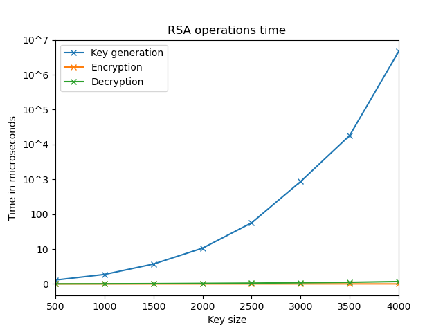
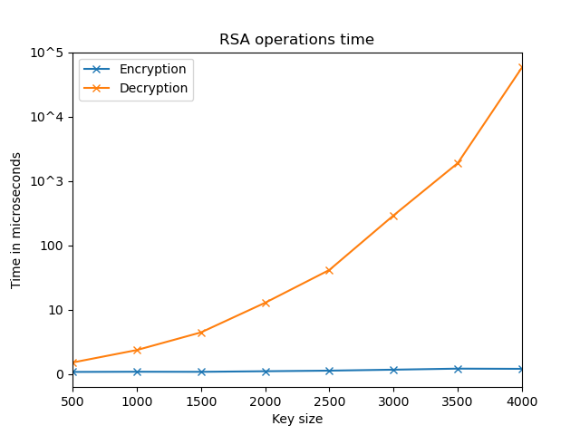
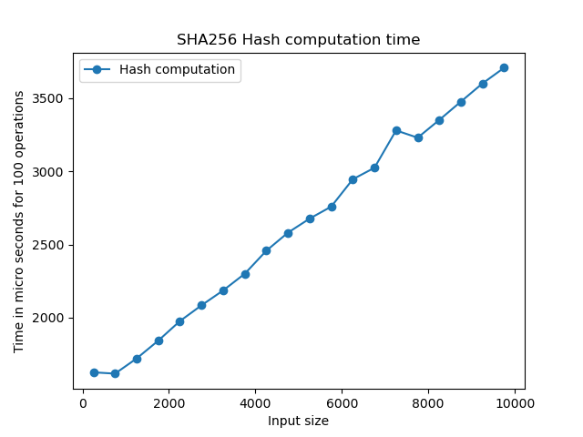
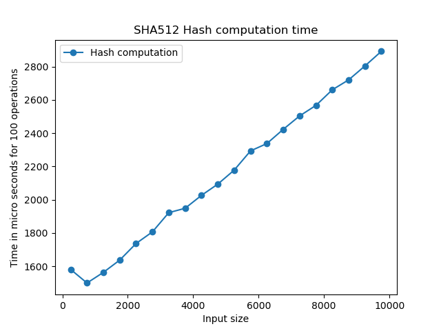
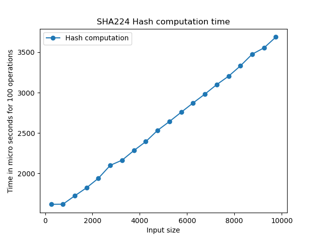
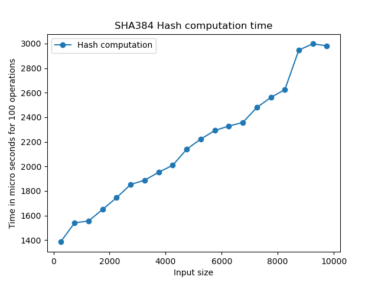
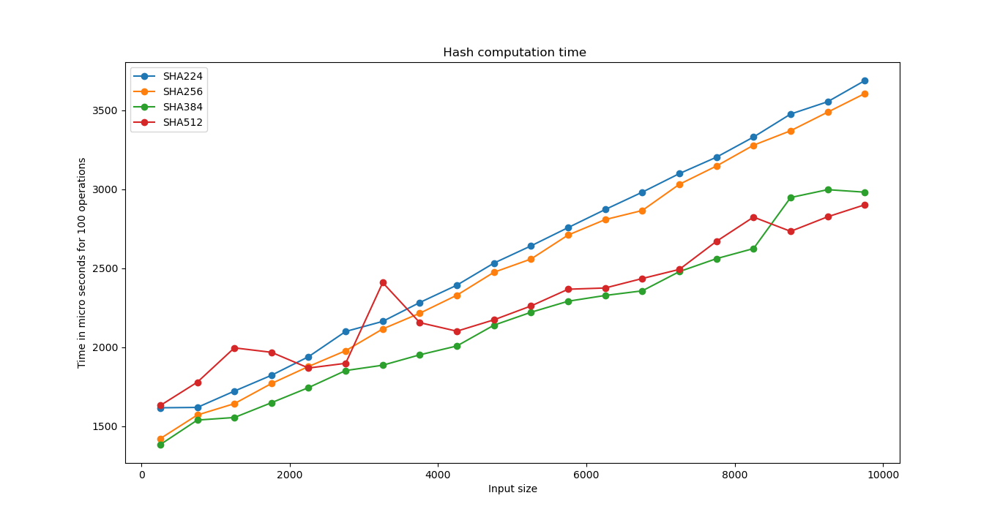
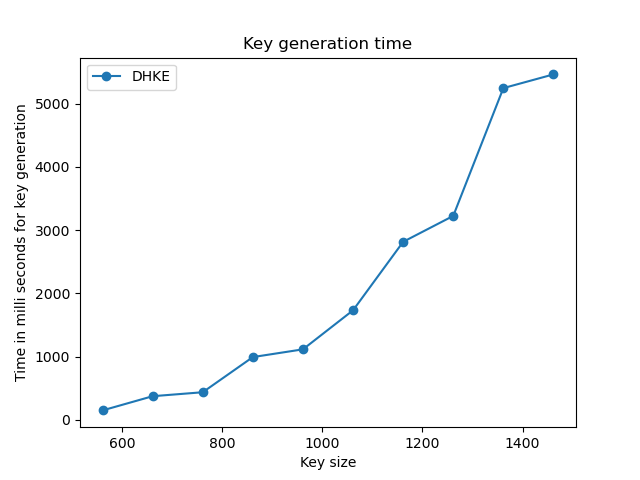

# Cryptography operations time plotting
##  Operations:
- RSA 
- Hashing
- [Diffie Hellman Key Exchange](https://en.wikipedia.org/wiki/Diffie%E2%80%93Hellman_key_exchange)

##  RSA Operations
Plotting the Performance graphs of following operations of [RSA cryptosystem ](https://en.wikipedia.org/wiki/RSA_(cryptosystem)) using 
[Cryptography](https://pypi.org/project/cryptography/) library in [Python](https://www.python.org/).

Operations :
- Encryption
- Decryption
- Key size

This is aimed at the recreation of  the graph in [Cryptography Book](#cryptography-book) Chapter 6: Public Key Cryptography and RSA, Page 79, Figure 6.4.

## Hash operations
Plotting the time(in microseconds) of Hash calculation for no. of iterations of for given input sizes using [RSA cryptosystem ](https://en.wikipedia.org/wiki/RSA_(cryptosystem)) using 
[Cryptography](https://pypi.org/project/cryptography/) library in [Python](https://www.python.org/).

### Hash Functions:
- [SHA224](https://en.wikipedia.org/wiki/SHA-2)
- [SHA256](https://en.bitcoinwiki.org/wiki/SHA-256)
- [SHA384](https://en.wikipedia.org/wiki/SHA-3)
- [SHA512](https://en.bitcoinwiki.org/wiki/SHA-512)

## Results

RSA time with key            |  RSA time without key
:-------------------------:|:-------------------------:
|

SHA 256 Hash time            |  SHA 512 Hash time
:-------------------------:|:-------------------------:
|

SHA 224 Hash time            |  SHA 384 Hash time
:-------------------------:|:-------------------------:
|

SHA compared

Diffie Hellman Key Exchange

## Features 
- Ability to set starting key size, key size range, no of iterations per key size, time unit and y-axis ticks(labels).
- Clubbing of points, multiple iteration and data average for error free data and smooth plot.
- Saves and read data from respective data files in data_dump directory.

## Setup

Clone this repo to your desktop and install the [Libraries used](#libraries-used)</a> using [pip](https://pypi.org/project/pip/).

## Usage
After you clone this repo to your desktop, go to its root directory and run with main.py file in your Python IDE respective graph matplotlib dialog with the output graph.

## Libraries used

This project uses the following open source packages:

- [Matplotlib](https://matplotlib.org/)
- [Pickle](https://docs.python.org/3/library/pickle.html)
- [Cryptography](https://pypi.org/project/cryptography/)
- [Time](https://docs.python.org/3/library/time.html)

## Cryptography Book :notebook_with_decorative_cover:
Cryptography, Network Security, and Cyber Laws [Book](https://www.cengage.co.in/book-list/print/cryptography-network-security-and-cyber-laws-sl) authored by  Bernard L. Menezes | Ravinder Kumar.
ISBN: 9789386858948
Edition: 1st
Year : 2018

## Constraints ⚠
-   RSA: [Cryptography library](https://pypi.org/project/cryptography/) used has limitation of minimum key size of 800 to avoid errors of  Data too long for key size
even for empty string.
-   SHA operations: due to quick execution, SHA operations are measured in bunch of operations.    
-   Diffie Hellman Key Exchange: [Cryptography library](https://pypi.org/project/cryptography/) used has limitation of minimum key size of 512 bytes fixed. 

